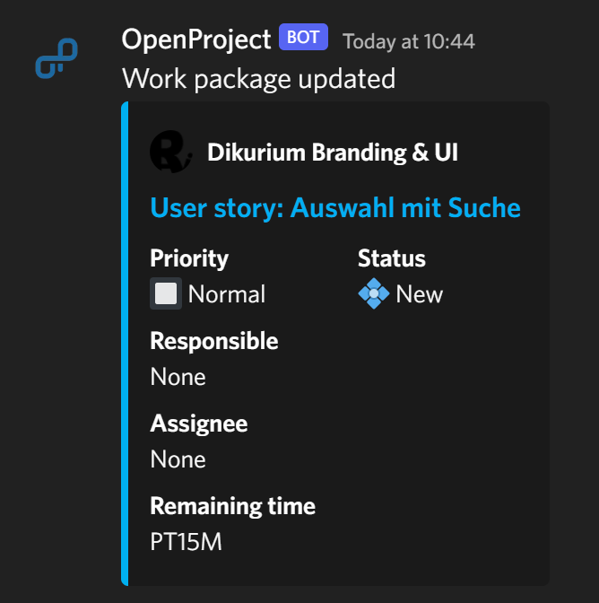

[](https://github.com/Dan6erbond/openproject-discord-webhook-proxy/actions/workflows/docker-image.yml)

# OpenProject Discord Webhook Proxy

A webhook proxy for [OpenProject webhooks](https://www.openproject.org/docs/system-admin-guide/incoming-and-outgoing/webhooks/) to Discord written in Go.

## Features

- Rich embeds for OpenProject updates in Discord
- Request logging to S3 or local storage
- Configuration in YAML

### Supported Webhooks

- [x] `work_package:created`
- [x] `work_package:updated`

## Screenshots



## Deploying

You can launch the service as a simple Docker container:

```sh
docker run -v "./config.yaml:/app/config.yaml" -p "5001:5001" dan6erbond/openproject-discord-webhook-proxy:latest
```

A `config.yaml` needs to be provided which provides configuration for the service and webhooks. For more information see [Configuration](#configuration) below.

> **Note:** If local storage is enabled, it is recommended to add a volume mount to `/app/requests` to view the requests on the host machine.

### Docker Compose

A sample [`docker-compose.yml`](./docker-compose.yml) is provided with MinIO as the storage provider for request logs. You need to launch MinIO initially at [http://localhost:9002](http://localhost:9002) to create a bucket and service account, which can then be configured. See [Configuration](#configuration).

### Kubernetes

You can use Terraform to deploy the proxy to Kubernetes.

[Dan6erbond/openproject-discord-webhook-proxy/kubernetes](https://registry.terraform.io/modules/Dan6erbond/openproject-discord-webhook-proxy/kubernetes/latest)

For further deployment instructions on Kubernetes see the Terraform registry.

## Configuration

All the configuration options, including webhooks, are stored in a `config.yaml` at the root level of the application.

The available options, with their defaults if applicable, are shown below:

```yml
server:
  # 0.0.0.0 for Docker and Kubernetes
  host: 127.0.0.1
  port: 5001
# Add this section if you want request logging
storage:
  s3:
    bucketName: <your-s3-bucket>
    region: <region>
    endpoint: s3.amazonaws.com
    accessKey: <access-key>
    secretKey: <secret-key>
    useSSL: true
  local:
    path: <folder>
webhooks:
  - name: <webhook-name>
    url: <discord-webhook-url>
    # Actions to enable webhooks for, if left empty will handle all supported actions
    actions:
      - <action>
    secret: <secret>
openproject:
  # Required to generate URLs
  baseUrl: <openproject-base-url>
```
